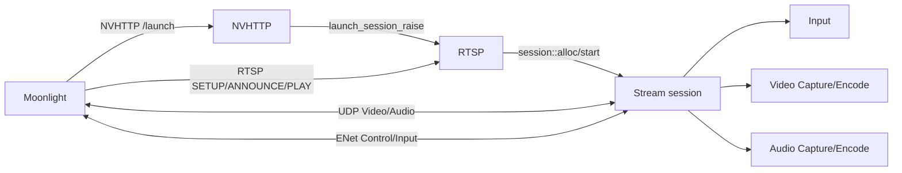
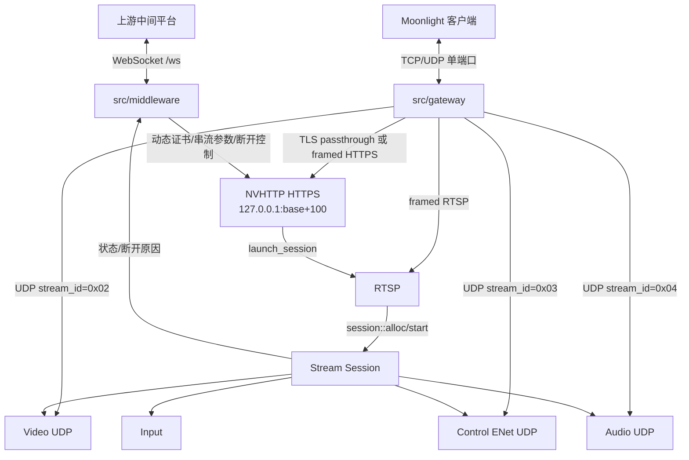
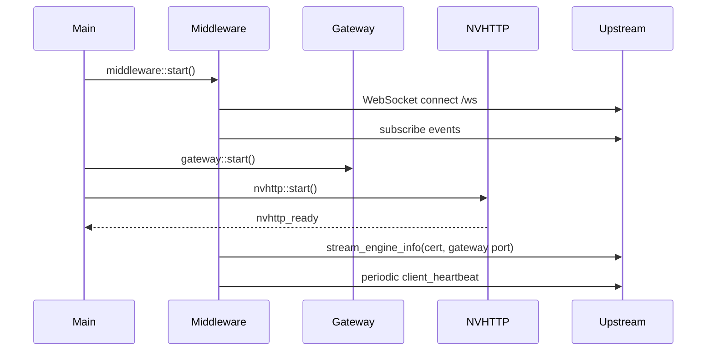
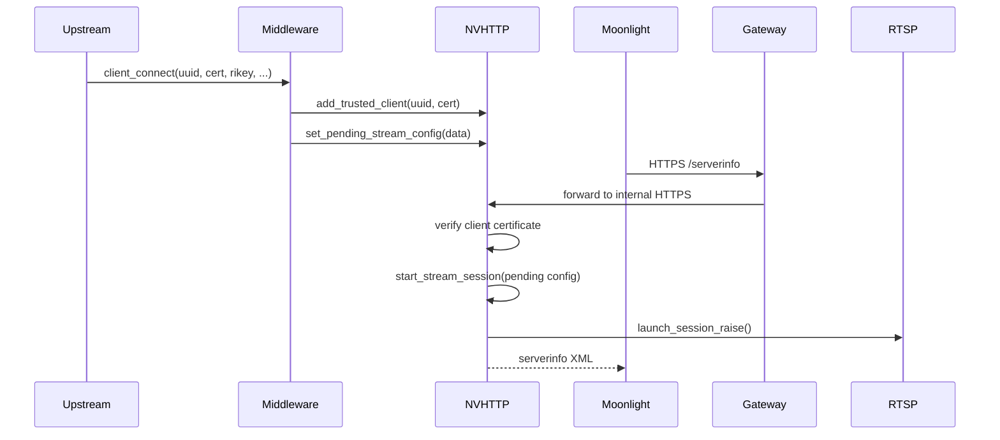
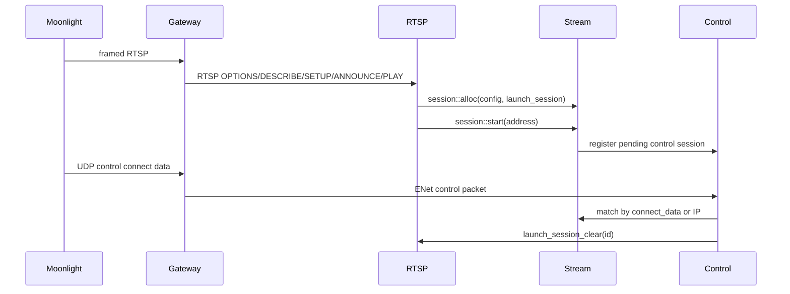
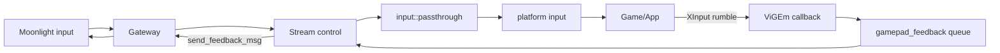

# Sunshine 中间件/网关架构说明

本文档基于 `3f8c6e25^..7c535b69` 的提交范围整理，范围解释为“包含 `3f8c6e25` 这次提交开始，到当前最新提交 `7c535b69`”。文档同时补充原 Sunshine 的基础架构，便于理解本次改造是在原 GameStream 主机模型上增加了哪些层。

## 1. 总览

原 Sunshine 的核心是一个 GameStream 兼容主机：Moonlight 通过 NVHTTP 获取服务信息和发起 `/launch`，随后通过 RTSP 完成会话协商，再通过 UDP/ENet 传输视频、音频、控制和输入数据。

本提交范围内的当前架构在原模型外侧增加了三类能力：

- 上游中间平台控制面：`middleware` 作为 WebSocket 客户端连接上游 `/ws`，接收授权、断开、超时、显示配置、虚拟手柄按键等控制事件，并把引擎信息、心跳和断开原因回传上游。
- 单端口网关：`gateway` 对外只暴露 `config::sunshine.port` 一个 TCP/UDP 端口，再按协议头把流量转发到内部 NVHTTP、RTSP、Video、Control、Audio 端口。
- 会话和手柄稳定性改造：NVHTTP 支持动态证书信任和中间件预置串流参数；Stream 支持基于 session id 的会话匹配、挂机检测、上游强制断开、网关模式端口重写；Input/Windows ViGEm 支持手柄预创建和安全反馈队列。

## 2. 提交范围

本轮架构整理覆盖这些提交：

| 提交 | 主题 |
| --- | --- |
| `3f8c6e25` | 配置文件由 `sunshine.conf` 改为 `engine.conf` |
| `be3a1225` | 挂机检测与自动断开，支持断开通知上游 |
| `c299a57f` | 挂机/待机超时默认值改为 15 分钟 |
| `8c19c7f8` | WebSocket 路由改为 `/ws` |
| `bfd4d90e` | Boost 版本要求修正为 1.90.0 |
| `bf2f8f6f` | CMake 最低版本范围语法和 CMP0167 策略 |
| `5aed6d08` | 修正 `safe::queue_t::pop()` optional 使用 |
| `f792181c` | 补充中间件和串流逻辑 |
| `bf0f3cc5` | 初版改造 |
| `a01468e5` | 优化逻辑 |
| `e300907a` | 初版串流，手柄未正常 |
| `7c535b69` | 完全版适配 |

主要新增/修改模块：

- `src/middleware.cpp`, `src/middleware.h`
- `src/gateway.cpp`, `src/gateway.h`
- `src/nvhttp.cpp`, `src/nvhttp.h`
- `src/rtsp.cpp`, `src/rtsp.h`
- `src/stream.cpp`, `src/stream.h`
- `src/input.cpp`, `src/input.h`
- `src/platform/windows/input.cpp`
- `src/config.cpp`, `src/config.h`
- `src/main.cpp`

## 3. 原 Sunshine 架构基线

### 3.1 进程启动

原 Sunshine 启动后按大致顺序初始化：

1. 解析配置和初始化日志。
2. 初始化平台层、进程管理、输入层、Reed-Solomon FEC。
3. 探测手柄和视频编码器。
4. 启动 HTTP/NVHTTP 服务、RTSP 服务、系统托盘、mDNS、UPnP。
5. 进入主线程 shutdown 等待循环。

原模型里 Web UI、NVHTTP、RTSP、音视频广播和输入处理都在 Sunshine 进程内，但 Moonlight 直接连接 Sunshine 的 GameStream 端口，不经过额外网关。

### 3.2 NVHTTP 控制面

NVHTTP 负责模拟 NVIDIA GameStream 的 HTTPS/HTTP API，典型端点包括：

- `/serverinfo`：返回主机名称、版本、PairStatus、编码能力、当前状态等。
- `/pair`：传统 PIN 配对流程，最终把客户端证书加入信任链。
- `/applist`、`/appasset`：返回应用列表和图标资源。
- `/launch`、`/resume`、`/cancel`：启动、恢复或取消串流会话。

传统模式下，Moonlight 通过 `/launch` 或 `/resume` 提交 `rikey/rikeyid/mode/appid` 等参数，NVHTTP 构造 `rtsp_stream::launch_session_t`，然后调用 `rtsp_stream::launch_session_raise()` 把会话交给 RTSP 线程。

### 3.3 RTSP 会话协商

RTSP 模块监听 `RTSP_SETUP_PORT` 映射出的端口，处理：

- `OPTIONS`
- `DESCRIBE`
- `SETUP`
- `ANNOUNCE`
- `PLAY`

RTSP 使用 `launch_session_t` 保存一次启动会话所需的密钥、IV、分辨率、帧率、音频参数、HDR、SOPS、客户端唯一标识等。RTSP 完成 `ANNOUNCE/SETUP` 后分配 `stream::session_t`，加入运行会话集合。

### 3.4 Stream 广播层

Stream 是真正的串流运行时，核心结构是：

- `broadcast_ctx_t`：全局广播上下文，包含 video/audio UDP socket、control ENet server、接收线程和音视频/control 线程。
- `session_t`：单个串流会话，包含 config、mail、input、video/audio/control 子状态、shutdown/controlEnd 事件和状态机。
- `control_server_t`：控制通道 ENet 服务，负责识别 peer、解密控制包、分发 input、IDR、loss stats、反馈消息等。

传统数据流是：



### 3.5 输入和手柄反馈

Moonlight 的输入包通过 control channel 到达 Stream，再调用 `input::passthrough()` 入队，最终由 task pool 调用平台输入接口注入键鼠、触摸、手柄状态。手柄震动、LED、触发器等反馈由平台层回调写入 `mail::gamepad_feedback`，再由 Stream control channel 发回 Moonlight。

## 4. 当前架构

### 4.1 顶层拓扑

当前架构保留原 Sunshine 的 NVHTTP/RTSP/Stream 核心，但新增上游中间件和单端口网关。



### 4.2 启动顺序

当前 `main.cpp` 的关键启动顺序是：

1. 初始化平台、进程、输入、编码器探测和 HTTP 基础设施。
2. 预创建 `mail::nvhttp_ready`，供中间件等待 NVHTTP 就绪。
3. 如果 `middleware_enabled=true`，启动 `middleware::start()`。
4. 启动 mDNS/UPnP。
5. 启动 `gateway::start()`，在对外 base port 上监听 TCP+UDP。
6. 启动 `nvhttp::start()` 线程。当前 HTTPS 绑定到 `127.0.0.1:base+100`，由网关转发外部访问。
7. 启动 `rtsp_stream::start()` 线程。
8. 进入主循环，等待 shutdown。

注意：当前 Web UI/HTTP 配置线程被移除或禁用，主要入口变成中间平台 + NVHTTP GameStream API。

## 5. 配置体系

配置文件从 `sunshine.conf` 改为 `engine.conf`。新增中间件相关配置位于 `config::sunshine.middleware`：

| 配置项 | 默认值 | 作用 |
| --- | --- | --- |
| `middleware_enabled` | `false` | 是否启用上游中间件 WebSocket 客户端 |
| `middleware_address` | `0.0.0.0` | 上游中间件地址 |
| `middleware_port` | `40002` | 上游中间件端口 |
| `middleware_gamepad_preinit` | `false` | 是否预创建虚拟手柄 |
| `force_disconnected_timeout` | `900` | 强制挂机断开阈值，秒 |
| `standby_disconnected_timeout` | `900` | 待机/无操作断开阈值，秒 |

## 6. Middleware 子系统

### 6.1 职责

`src/middleware.cpp` 是一个进程内 WebSocket 客户端，不是服务器。它连接上游平台：

```text
ws://<middleware_address>:<middleware_port>/ws
```

连接成功后订阅以下事件：

- `force_disconnected_time`
- `standby_disconnected_time`
- `display_config`
- `click_gamepad`
- `disconnected`
- `client_connect`
- `client_disconnect`

### 6.2 上游事件处理

| 事件 | 当前行为 |
| --- | --- |
| `force_disconnected_time` | 更新 `config::sunshine.middleware.force_disconnected_timeout` |
| `standby_disconnected_time` | 更新 `standby_disconnected_timeout` |
| `display_config` | 接收显示/码率或质量相关配置，当前主要记录和扩展使用 |
| `click_gamepad` | 调用 `input::click_gamepad(0, button)` 注入手柄按键 |
| `disconnected` | 触发 `mail::force_disconnect`，由 Stream 控制线程断开会话 |
| `client_connect` | 调用 `nvhttp::add_trusted_client(uuid, cert)` 动态授权客户端证书；如携带 `rikey` 等串流参数，则调用 `nvhttp::set_pending_stream_config(data)` |
| `client_disconnect` | 调用 `nvhttp::remove_trusted_client(uuid)` 移除授权 |

### 6.3 下行到上游

`middleware::send_to_upstream()` 是线程安全入口。它把内部事件包装成：

```json
{
  "event": "send_to_upstream",
  "message_id": 0,
  "data": { }
}
```

并通过 `g_outgoing_queue` 投递到中间件 io_context 线程写 WebSocket。

主要上报：

- `stream_engine_info`：包含 Sunshine 证书、gateway port、protocol、internal HTTPS port。
- `client_heartbeat`：每 30 秒上报 `net_connected`。
- `disconnected`：挂机、网络超时或上游强制断开后的原因。

## 7. Gateway 子系统

### 7.1 目标

`src/gateway.cpp` 把 Sunshine 原本多个 GameStream 端口收敛为一个对外 base port。它同时监听：

- TCP `0.0.0.0:<base>`
- UDP `0.0.0.0:<base>`

内部服务仍按原 Sunshine 端口模型运行，但被绑定或转发到本机端口。

### 7.2 TCP 协议

TCP 第一个字节决定路由：

| 首字节 | 含义 | 路由 |
| --- | --- | --- |
| `0x16` | TLS ClientHello | 直通到内部 NVHTTP HTTPS `127.0.0.1:base+100` |
| `0x01` | framed HTTPS | 读取 `[stream_id][len_be16][payload]`，转发到内部 NVHTTP |
| `0x05` | framed RTSP | 读取 framed payload，转发到 RTSP setup 端口 |

其中 HTTPS framed 响应也会被 gateway 包装为：

```text
[stream_id:1][length:2 big-endian][payload]
```

### 7.3 UDP 协议

UDP 统一使用 3 字节 gateway 头：

```text
[stream_id:1][length:2 big-endian][payload]
```

Stream ID：

| ID | 名称 | 目标 |
| --- | --- | --- |
| `0x02` | Video | `stream::VIDEO_STREAM_PORT` |
| `0x03` | Control | `stream::CONTROL_PORT` |
| `0x04` | Audio | `stream::AUDIO_STREAM_PORT` |

Gateway 记录每个 stream id 的外部客户端 endpoint。内部服务向外发送时，gateway 根据已记录 endpoint 再加 gateway header 发回外部客户端。

### 7.4 队列和优先级

UDP 出站分队列处理：

- control 队列优先级最高。
- audio 次之。
- video 最后。

Audio/video 队列有包数和字节上限，超过后丢弃队首旧包；control 有独立队列和统计。这样能避免视频流量挤压控制和音频。

## 8. NVHTTP 子系统

### 8.1 当前端口模型

当前 NVHTTP HTTPS 不再直接对外绑定 base port，而是绑定：

```text
127.0.0.1 : config::sunshine.port + nvhttp::PORT_HTTPS_INTERNAL
```

`PORT_HTTPS_INTERNAL = 100`。对外访问由 gateway 转发。

HTTP server 被禁用，Web UI 路径不再作为主要入口。

### 8.2 动态客户端证书

`nvhttp::add_trusted_client(uuid, cert)` 会：

1. 解析 PEM X.509 证书。
2. 计算 SHA256 fingerprint。
3. 如果 uuid 已存在则替换证书并启用。
4. 否则追加到 `client_root.named_devices`。
5. 重建 `cert_chain` 并保存 state。

TLS 验证逻辑变为：

- TLS 握手阶段允许没有客户端证书。
- 请求处理前通过 verify callback 判断证书是否在信任链、是否 enabled。
- `/serverinfo` 等公共路径可以在无证书时响应；需要授权的路径由认证结果控制。

### 8.3 中间件驱动的串流启动

`client_connect` 事件携带 `rikey/rikeyid/width/height/fps/...` 时，middleware 调用：

```cpp
nvhttp::set_pending_stream_config(data)
```

之后 Moonlight 访问 `/serverinfo` 时，如果满足：

- HTTPS 请求已通过客户端证书验证。
- 当前没有 running session。
- 存在 `pending_stream_config`。

NVHTTP 会调用：

```cpp
start_stream_session(*pending_stream_config)
```

该函数创建 `rtsp_stream::launch_session_t`，配置 RTSP 加密、显示参数、音频参数、随机 ping payload 和 control connect data，然后调用 `rtsp_stream::launch_session_raise()`。

### 8.4 传统启动仍保留

传统 Moonlight `/launch` 和 `/resume` 路径仍存在：

- 解析 query 参数。
- 配置显示和探测编码器。
- 检查强制加密要求。
- 可选启动应用进程。
- 返回 `sessionUrl0`。
- 调用 `rtsp_stream::launch_session_raise()`。

## 9. RTSP 子系统

`rtsp_stream::launch_session_t` 是 NVHTTP 和 RTSP/Stream 之间的会话交接结构。当前字段包括：

- 会话 ID：`id`
- RTSP/control/video/audio 密钥：`gcm_key`, `iv`, `rtsp_cipher`, `rtsp_iv_counter`
- ping/session 识别：`av_ping_payload`, `control_connect_data`
- 显示和音频配置：width/height/fps/gcmap/surround/HDR/SOPS 等
- `client_cert`：用于会话结束时按证书清理或定位

RTSP server 维护：

- 一个 pending `launch_event`。
- 一个 active session set。
- 一个 pending session 超时 timer。

`launch_session_clear(id)` 在 control channel 连接成功后清理对应 pending launch，避免旧会话残留。

## 10. Stream 子系统

### 10.1 核心结构

`stream::session_t` 保存单会话运行时状态：

- `config`：音视频、包大小、QoS、feature flags、加密 flags。
- `mail`：会话内事件和队列。
- `input`：会话输入上下文。
- `video`：视频 peer、cipher、IDR/invalidate 事件、QoS。
- `audio`：音频 peer、CBC cipher、FEC buffer、QoS。
- `control`：ENet peer、GCM cipher、connect data、feedback queue、HDR queue。
- `state`：STOPPED/STARTING/RUNNING/STOPPING。

### 10.2 Control 会话匹配

`control_server_t::get_session()` 支持两种模式：

- 新客户端：如果有 `ML_FF_SESSION_ID_V1`，使用 ENet connect data 匹配 `session->control.connect_data`。
- 旧客户端：回退到 IP 地址匹配。

匹配成功后：

1. 调用 `rtsp_stream::launch_session_clear(session_p->launch_session_id)`。
2. 记录 control peer。
3. 记录本地地址，用于多网卡场景下音视频发送源地址。
4. 写入 `_peer_to_session`，后续 O(1) 查找。

### 10.3 Control 线程职责

`controlBroadcastThread()` 处理：

- ENet control 消息读取和分发。
- encrypted control v2 解密。
- legacy input 解密。
- loss stats、IDR、invalidate ref frames。
- input packet 投递到 `input::passthrough()`。
- 上游强制断开事件。
- 挂机/待机断开检测。
- ping timeout 检测。
- gamepad feedback 和 HDR 消息发送。

### 10.4 挂机和断开

输入层在 `input::passthrough()` 每次收到输入时更新 `last_input_time`。控制线程周期性计算 idle 秒数：

- 达到 `force_disconnected_timeout`：停止会话并向上游发送 `disconnected`。
- 达到 `standby_disconnected_timeout`：停止会话并向上游发送 `disconnected`。
- 超过 `config::stream.ping_timeout`：认为网络异常，停止会话并上报。
- 收到 `mail::force_disconnect`：停止所有 RUNNING 会话。

### 10.5 网关模式下的 AV peer 改写

Video/audio 线程通过 `recv_ping()` 等待客户端 ping。若 gateway 已记录外部客户端 IP，且 session 的 video/audio peer 是 loopback，则把发送目标改成：

```text
127.0.0.1 : net::map_port(VIDEO_STREAM_PORT) + gateway::UDP_FWD_OFFSET
127.0.0.1 : net::map_port(AUDIO_STREAM_PORT) + gateway::UDP_FWD_OFFSET
```

这样 video/audio 仍由原 Stream socket 发送，但目标变成 gateway 的内部 UDP forwarder，由 gateway 再封装后发给外部 Moonlight。

## 11. Input 和手柄子系统

### 11.1 输入队列

Control channel 收到输入后调用：

```cpp
input::passthrough(session->input, std::move(plaintext))
```

Input 模块会：

1. 更新最后输入时间。
2. 把原始 input packet 放入 `input_queue`。
3. 通过 task pool 异步解析并调用平台层注入。

支持包类型包括键盘、鼠标、滚轮、触摸、手柄 arrival、手柄状态、touch、motion、battery。

### 11.2 上游虚拟按键

Middleware 的 `click_gamepad` 事件映射到 `platf::A/B/X/Y/DPAD/...`，调用：

```cpp
input::click_gamepad(0, button_flag)
```

当前它只对 slot 0 生效，并会检查 slot 是否已分配。

### 11.3 手柄预创建

Windows ViGEm 后端支持 `middleware_gamepad_preinit`。当前设计是：

- Sunshine 启动输入平台时预创建固定数量的手柄槽位。
- Windows 下 `PREINITIALIZED_GAMEPADS = 1`。
- 预创建 slot 0 持续存在，直到 Sunshine 退出。
- Moonlight 第一只手柄复用 slot 0，并在到达时绑定当前会话的 `feedback_queue`。
- 第二只及之后手柄走动态创建/释放。
- 预创建槽位在会话断开时只重置状态和解绑反馈队列，不移除 ViGEm target。

### 11.4 手柄反馈

平台层把 rumble/RGB/trigger/motion feedback 写入 `mail::gamepad_feedback`。Stream control 线程从 `session->control.feedback_queue` 取消息，经 `send_feedback_msg()` 转为 Moonlight control packet。

反馈类型包括：

- `rumble`
- `rumble_triggers`
- `set_motion_event_state`
- `set_rgb_led`
- `set_adaptive_triggers`

Windows ViGEm 回调会去重上一次 rumble/RGB 状态，并在没有绑定 `feedback_queue` 时直接返回，避免空队列访问。

## 12. 关键数据流

### 12.1 启动和注册到上游



### 12.2 中间件授权并准备串流



### 12.3 RTSP 到运行会话



### 12.4 输入和反馈



## 13. 线程模型

| 线程/组件 | 主要职责 |
| --- | --- |
| main thread | 初始化、shutdown 等待、托盘生命周期 |
| middleware thread | WebSocket connect/read/write、心跳、重连 |
| gateway thread | TCP accept、UDP receive、内部 forwarder、出站队列 |
| nvhttp thread + HTTPS worker | GameStream HTTPS API、证书验证、serverinfo/launch/resume |
| rtsp thread | RTSP accept 和命令处理 |
| rtsp::handler | session cleanup 和 RTSP loop |
| stream::controlBroadcast | ENet control、input 解密、断开/idle 检测、反馈发送 |
| stream video/audio threads | 等待 ping、启动 capture、发送 RTP/FEC |
| task_pool | 输入包解析、平台输入注入、ViGEm 回调任务等 |

## 14. 端口和协议约定

| 名称 | 位置 | 说明 |
| --- | --- | --- |
| `config::sunshine.port` | public gateway TCP/UDP | 对外唯一端口 |
| `base + nvhttp::PORT_HTTPS_INTERNAL` | `127.0.0.1` | 内部 NVHTTP HTTPS，当前 offset `100` |
| `rtsp_stream::RTSP_SETUP_PORT` | mapped port | RTSP setup，gateway framed TCP 0x05 转发 |
| `stream::VIDEO_STREAM_PORT` | mapped port | 原 video UDP |
| `stream::CONTROL_PORT` | mapped port | 原 control ENet UDP |
| `stream::AUDIO_STREAM_PORT` | mapped port | 原 audio UDP |
| `gateway::UDP_FWD_OFFSET` | internal forwarder offset | video/audio gateway outbound forwarder offset，当前 `200` |

Gateway stream IDs：

| ID | 含义 |
| --- | --- |
| `0x01` | HTTPS framed |
| `0x02` | Video UDP |
| `0x03` | Control UDP |
| `0x04` | Audio UDP |
| `0x05` | RTSP framed |

## 15. 模块边界

| 模块 | 对外接口 | 不应承担的职责 |
| --- | --- | --- |
| `middleware` | `start()`, `send_to_upstream()`, `notify_client_state()` | 不直接操作 socket 流量和音视频数据 |
| `gateway` | `start()`, `get_client_ip()`, `get_client_port()` | 不解析 GameStream 业务协议，只按 stream id/首字节转发 |
| `nvhttp` | GameStream HTTP API、证书信任、pending stream config | 不直接创建 Stream 线程，只创建 `launch_session` |
| `rtsp_stream` | RTSP 协商、pending launch、active session set | 不处理上游平台逻辑 |
| `stream` | Control/AV runtime、session lifecycle、idle disconnect | 不管理证书持久化 |
| `input` | 输入包解析、平台输入注入、手柄槽位映射 | 不做网络发送 |
| `platform/windows/input` | ViGEm/Windows 输入实现 | 不理解 Moonlight 会话，只绑定 feedback queue |

## 16. 设计影响和风险点

- Gateway 将多个端口压缩为单端口后，Moonlight 客户端或中间平台必须遵守 gateway framed TCP/UDP 协议，否则内部 RTSP/AV 无法匹配。
- Middleware 动态授权证书后，NVHTTP 的信任链需要和 state 文件保持一致；异常断开时要注意清理临时或已撤销客户端。
- `pending_stream_config` 当前是全局 optional，天然更适合单客户端/单 pending 会话；多客户端并发时需要按 uuid 或证书隔离。
- Stream control 匹配优先使用 `ML_FF_SESSION_ID_V1` 的 connect data，这是网关/NAT 场景下比 IP 匹配更可靠的方式。
- 手柄预创建 slot 0 是长生命周期对象，断开时不能释放 ViGEm target，只能解绑当前会话 feedback queue。
- 反馈队列属于会话 mail，平台回调必须在会话绑定后才能发送，未绑定时应丢弃，避免跨会话反馈。

## 17. 建议后续文档

- `gateway-protocol.md`：单独定义 framed TCP/UDP 格式、stream id、长度限制和错误处理。
- `middleware-events.md`：定义上游事件 JSON schema、ack 格式和断开原因枚举。
- `session-lifecycle.md`：画清楚 pending launch、RTSP、control connect、running、stopping、cleanup 的状态转换。
- `gamepad-lifecycle.md`：记录预创建 slot、动态 slot、feedback queue 生命周期和 Windows/Linux 差异。